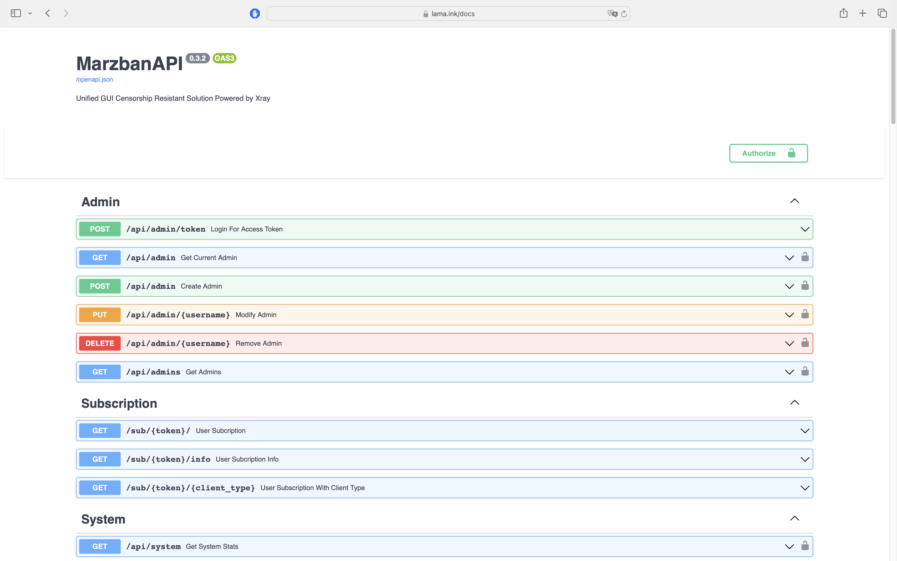

import { LinkCard, CardGrid } from "@astrojs/starlight/components";

## Описание

Marzban предоставляет REST API, который позволяет разработчикам программно взаимодействовать со службами Marzban.



Чтобы просмотреть документацию по API, перейдите на

<LinkCard title="API" href="https://api.marzban.dev" />
Чтобы просмотреть документацию по API в Swagger UI или ReDoc локально, установите
переменную в файле env:

```bash
sudo nano /opt/marzban/.env
```

Изменяем в нем следующие переменные

```
// /opt/marzban/.env
DOCS=True
```

Перейдите в браузере `http://YOUR_DOMAIN/docs` или `http://YOUR_DOMAIN/redoc`.
