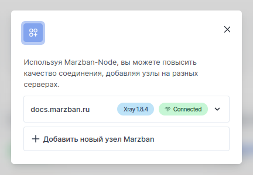
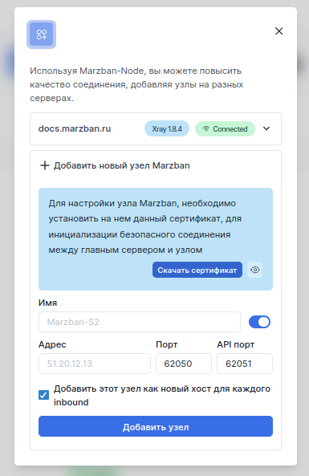
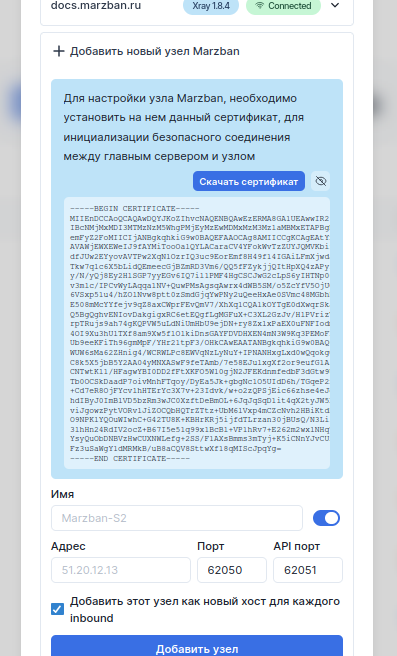
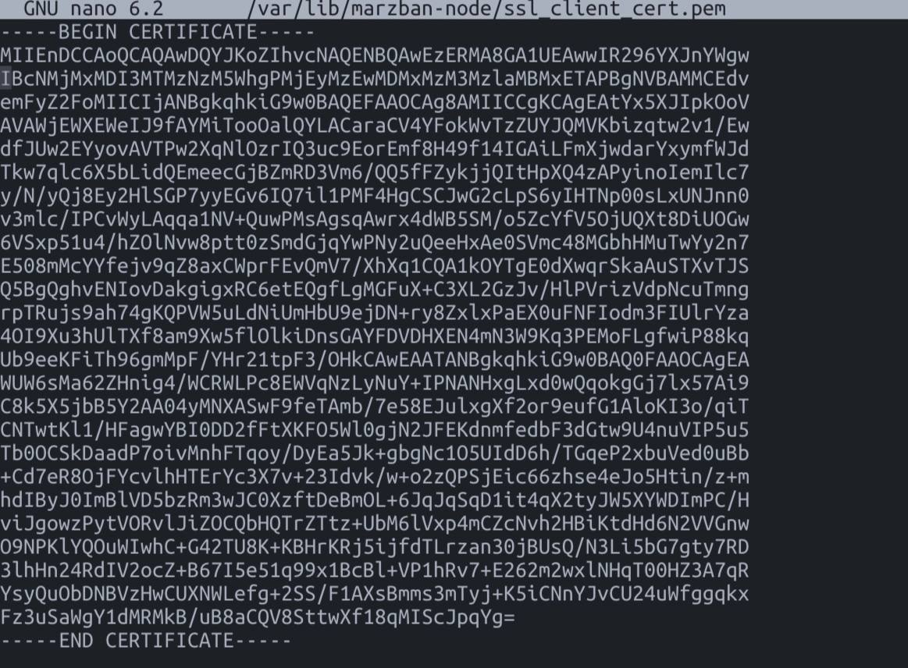
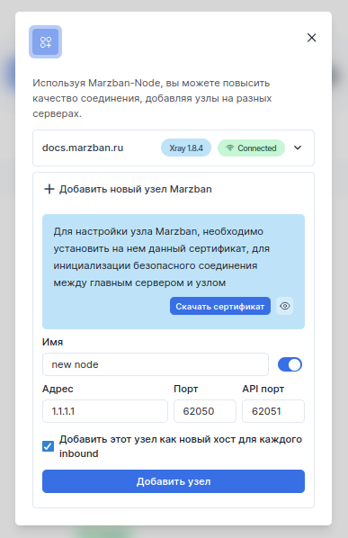

import { Steps, FileTree, Card, CardGrid } from "@astrojs/starlight/components";

:::note
Если Вы не планируете использовать дополнительные узлы (например для расширения географии Вашего сервиса), можете пропустить данный шаг.
:::

:::note
Узел - продолжение вашего сервиса и расширение существующей, центральной панели, дублировать установку панели на сервер узла не нужно.
:::

## Введение

**Marzban Node** - это приложение на Python, предоставляющее сервис для управления экземпляром ядра Xray.
Приложение разработано с учетом требований безопасности и использует взаимную аутентификацию самоподписанными SSL-сертификатами, для связи между панелью и ее клиентами(узлами).

В зависимости от Вашего выбора, приложение может использовать или RPyC для удаленных вызовов процедур, или REST, используя стандартные HTTP-методы (GET, POST, PUT, DELETE и т.д.) для выполнения различных операций.

С помощью этого руководства вы можете создать узел Marzban Node на дополнительном сервере и подключить его к панели.

Используемые файлы:

<FileTree>

    - ~/Marzban-node/ 
        - **.env** 
        - **docker-compose.yml**
</FileTree>

## Установка

:::note
Обратите внимание, что и Ваша панель и узел должны быть обновлены до последних `latest` версий
:::

### Получение ключа

<Steps>
  1. Открываем настройка узлов
   2.
  Переходим в меню добавление нового узла 3. Скачиваем сертификат
   4. Или,
  копируем его значение из меню.
  
</Steps>

Теперь переходим на наш узел.

### Настройка узла

<Steps>
1. Обновляем сервер 
    ```bash
    sudo apt-get update && sudo apt-get upgrade
    ```
2. Устанавливаем нужный софт
    ```bash
    sudo apt install socat -y && sudo apt install curl socat -y && apt install git -y
    ```
3. Клонируем репозиторий    
    ```bash
    git clone https://github.com/Gozargah/Marzban-node
    ```
4. Входим в рабочую папку узла
    ```bash
    cd Marzban-node
    ```
5. Устанавливаем Docker
    ```bash
    sudo curl -fsSL https://get.docker.com | sh
    ```
6. Создаем папку, куда поместим наш сертификат
    ```bash
    sudo mkdir -p /var/lib/marzban-node/
    ```
7. Копируем ранее полученный ключ
    ```bash
    sudo nano /var/lib/marzban-node/ssl_client_cert.pem
    ```
          
8. Редактируем файл `docker-compose.yml`

    ```bash
    sudo nano docker-compose.yml
    ```
    приведя его к такому виду:

    ```yaml
    // ~/Marzban-node/docker-compose.yml
    services:
      marzban-node:
        image: gozargah/marzban-node:latest
        restart: always
        network_mode: host

        volumes:
          - /var/lib/marzban-node:/var/lib/marzban-node

        environment:
          SSL_CLIENT_CERT_FILE: "/var/lib/marzban-node/ssl_client_cert.pem"
          SERVICE_PROTOCOL: rest

    ```

</Steps>
Доступные переменные окружения
| Переменная     | Описание  | Значение по умолчанию |
| -------------- | -------------------- | -----------|
| `SERVICE_PORT`  | Сервисный порт |62050|
| `XRAY_API_PORT`   | Порт API xray-core         |62051|
| `XRAY_EXECUTABLE_PATH` | Путь к исполняемым файлам xray    |/usr/local/bin/xray|
| `XRAY_ASSETS_PATH`  | Путь к ассетам xray        |/usr/local/share/xray|
| `SSL_CERT_FILE` | Сертификат узла для связи с панелью            |/var/lib/marzban-node/ssl_cert.pem|
| `SSL_KEY_FILE`  | Ключ сертификата для связи с панелью   |/var/lib/marzban-node/ssl_key.pem|
| `SSL_CLIENT_CERT_FILE`  | Сертификат панели для связи с узлом   |/var/lib/marzban-node/ssl_client_cert.pem|
| `SERVICE_PROTOCOL`  | Сервисный протокол   |rpyc|
| `DEBUG`  | Вывод отладочной информации   |false|
<Steps>

9. Запускаем узел

        ```bash
        sudo docker compose up -d
        ```

</Steps>

Теперь вернемся в основную панель

### Настройка панели

<Steps>
1. Открываем настройки узлов

    

2. Заполняем данные узла:

   - Name - Имя узла;
   - Adress - IP адрес узла.
   - Port - Оставляем по умолчанию, если не изменяли их.

   Оставляем галку, если хотим добавить узел в качестве нового хоста во все входящие

3. Жмем `Добавить узел`
   Если Вы не нажали галку `добавить узел в качестве нового хоста во все входящие`, Вы всегда сможете добавить узел в любой inbound, после ее подключения, просто указав ее адрес (IP или домен/суб-домен)
</Steps>

### Дополнительные советы

  <Card title="Совет 1" icon="star">
Если для лучшего управления узлами вы хотите назначить каждому узлу отдельный inbound, вам нужно добавить новый inbound с уникальным тегом и портом в настройках ядра (Core Settings).
  </Card>
    <Card title="Совет 2" icon="star">
Если вы планируете использовать конфигурации с TLS, вам нужно получить сертификат для вашего суб-домена узла. Кроме того, вместо нескольких сертификатов для разных субдоменов, вы можете получить один Wildcard сертификат для основного домена, чтобы использовать его для всех субдоменов.

  </Card>
    <Card title="Совет 3" icon="star">
Файл `docker-compose.yml` чувствителен к выравниванию строк и пробелам. Для проверки правильности настройки вы можете использовать инструмент `yamlchecker`.
  </Card>
    <Card title="Совет 4" icon="star">
Если вы внесли изменения в файл `docker-compose.yml`, перезапустите узлы с помощью следующей команды:

```bash
cd ~/Marzban-node
docker compose down --remove-orphans; docker compose up -d
```

  </Card>
