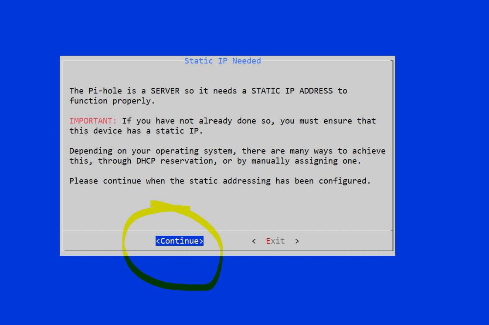
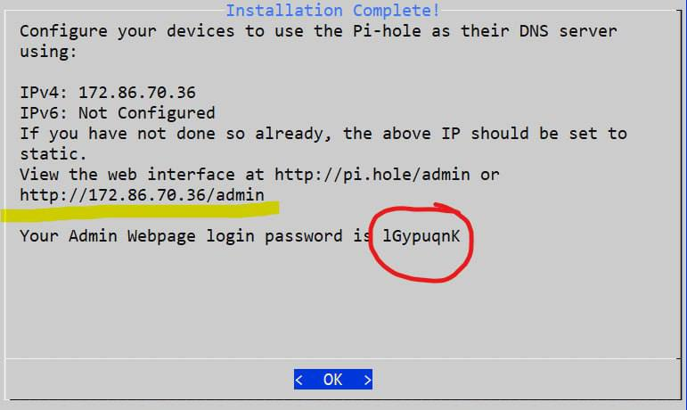
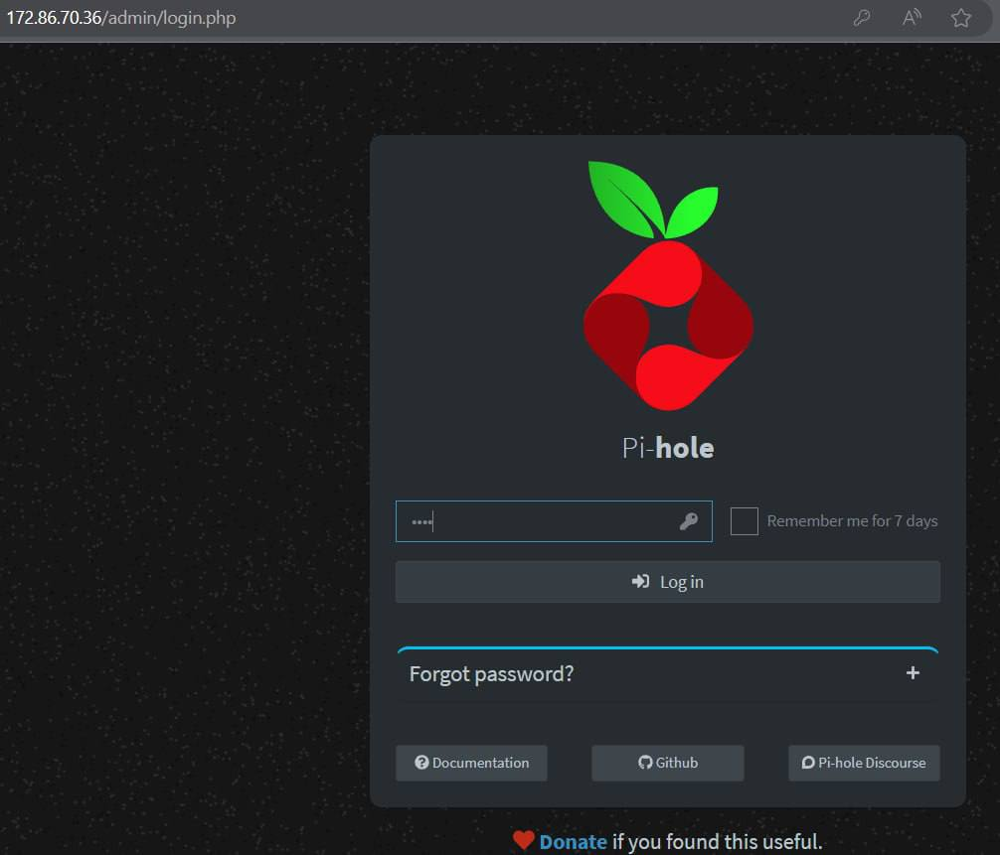
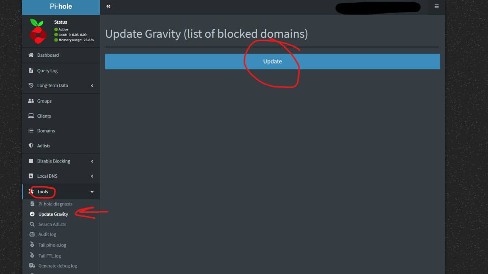
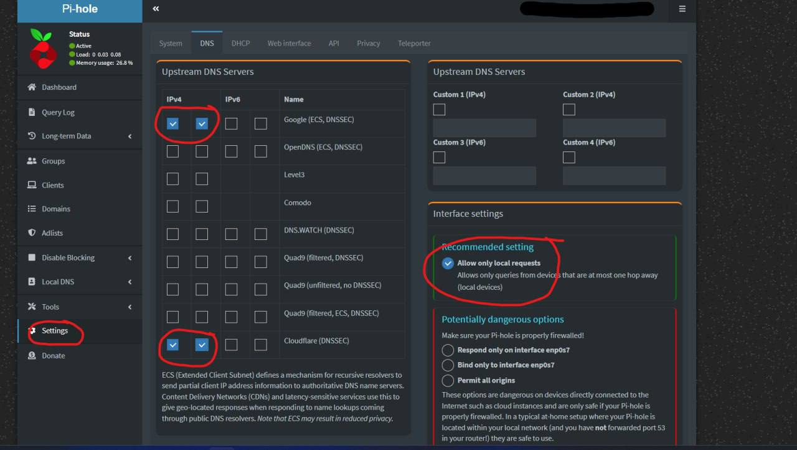
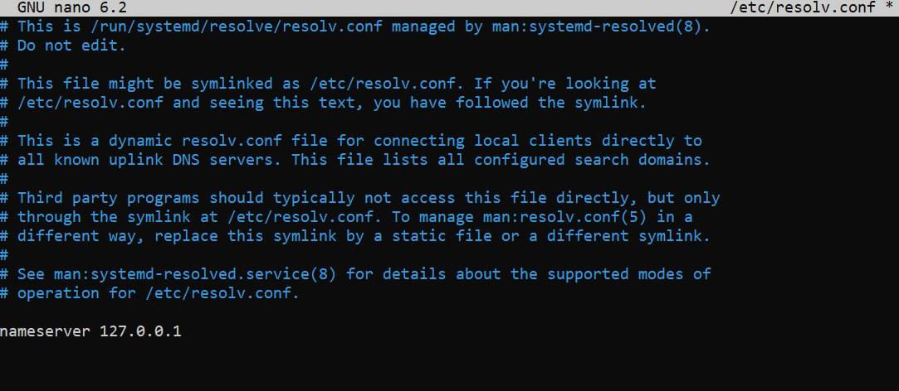
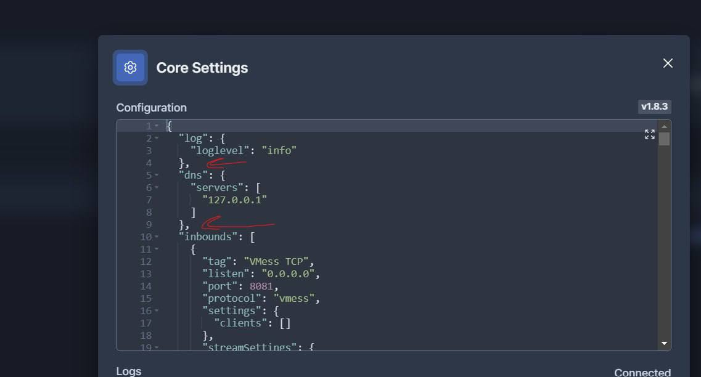
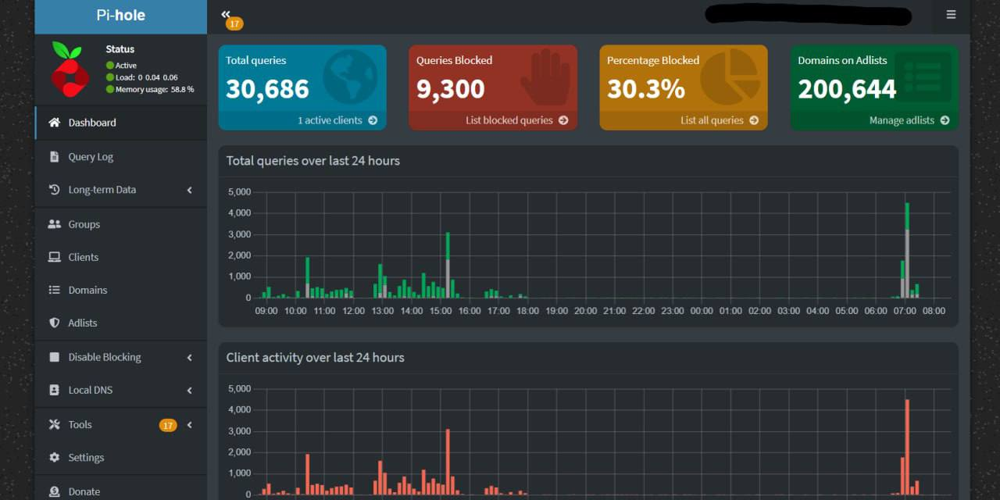

Для блокировки рекламы на стороне сервера, предлагается использовать программное решение Pi-Hole

> Pi-hole — это приложение для блокировки рекламы и интернет-трекеров на уровне сети Linux, которое действует как приемник DNS и, при необходимости, DHCP-сервер, предназначенный для использования в частной сети.

Для начала нам нужно обновить сервер

```bash
sudo apt update && apt upgrade -y
```

Установите pi-hole

```bash
curl -sSL https://install.pi-hole.net | bash
```

При достижения этапа STATIC IP, нам необходимо выбрать вариант "Продолжить" слева Продолжайте вводить "Yes" до завершения установки



В конце установки вы получите адрес и пароль (вы можете изменить пароль)



Запустите pi-hole

```bash
sudo systemctl start pihole-FTL
```

Измените пароль

```bash
pihole -a -p
```

Адрес входа в панель управления pi-hole

`IP-ADDRESS/admin`



Перейдите в настройки Pi-Hole

`Tools - Update Gravity -Update`



Обновите и затем перейдите к

`Setting - DNS`



Примените изменения и сохраните внизу страницы

Измените DNS-сервер
:::tip 
Для постоянного применения измений используйте `resolvconf` или любой другой инструмент вашей системы 
:::
```bash
nano /etc/resolv.conf
```

`nameserver 127.0.0.1`



Измените DNS-сервер в файле конфигурации вашего `xray-config.json`

```bash
nano /var/lib/marzban/xray_config.json
```

добавив туда

```json
"dns": {
    "servers": [
      "127.0.0.1"
    ]
  },
```

или сделав тоже самое через WebUI



Перезагрузить marzban

```bash
marzban restart
```

Готово! Теперь вы можете настроить сам Pi-Hole


