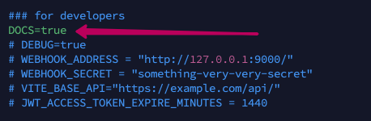
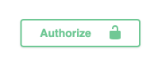
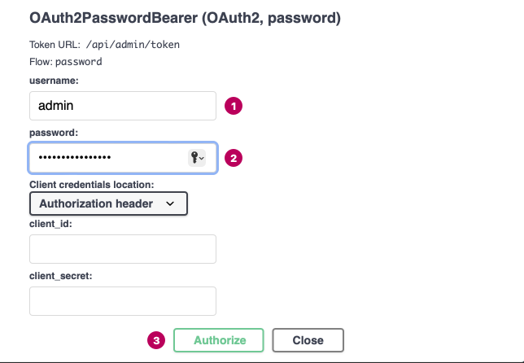
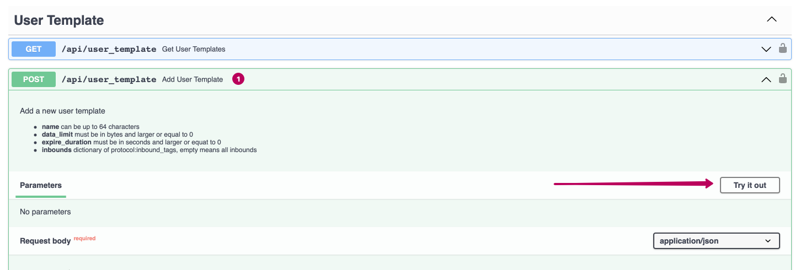
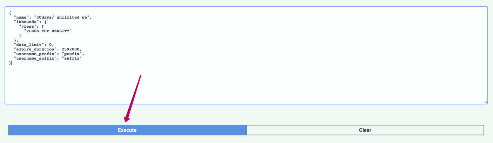
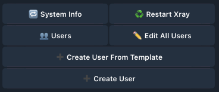
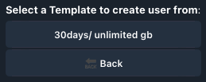
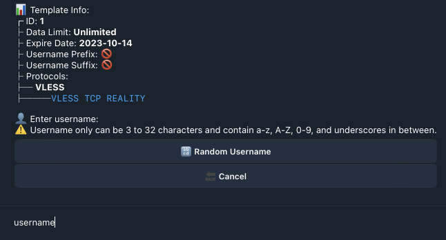
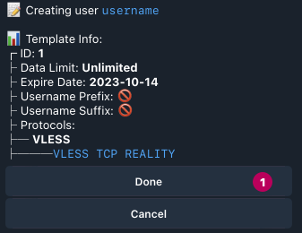
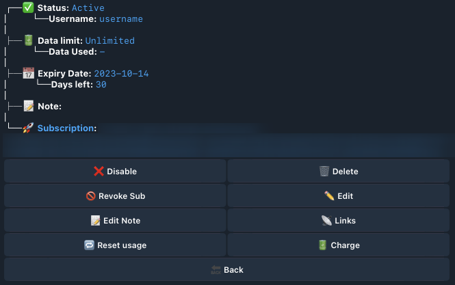

С помощью этого руководства вы можете создать пользовательские шаблоны для Telegram бота и на основе шаблонов создавать или редактировать пользователей Marzban.

Для начала, заходим на сервер, где установлен Marzban и открываем конфигурационный файл:

```bash
nano /opt/marzban/.env
```

Убираем комментарий `#` со строчки `DOCS=TRUE`, сохраняем файл:



Перезагружаем marzban:

```bash
marzban restart
```

Далее, в браузере переходим по адресу `https:/YOUR_DOMAIN.COM/docs`

Нажимаем на кнопку авторизации и вводим свои данные администратора:




Идем в раздел «`user_templates`» И выбираем «`Add User Template`». Внутри открытого спойлера нажимаем  «`Try it out`»


Вводим конфигурацию для пользовательского шаблона:

Например:

```json
{
  "name": "30days/ unlimited gb",
  "inbounds": {
    "vless": [
      "VLESS TCP REALITY"
    ]
  },
  "data_limit": 0,
  "expire_duration": 2592000,
  "username_prefix": "prefix",
  "username_suffix": "suffix"
}

```

где:

`«name»` - имя шаблона пользователя. В дальнейшем, оно будет отображаться в Telegram боте.

`«inbounds»` - теги inbounds, которые мы хотим добавить к пользовательскому шаблону. В данном случае, пользователь будет создаваться с VLESS TCP REALITY.

`«data_limit»` - ограничения по размеру трафика (в байтах). Например, 10 Гигабайт = 10737418240 Байт.  Значение «0» не ставит ограничения. Если строчку убрать совсем, то ограничений также не будет.

`«expire_duration»` - срок подписки пользователя (в секундах). Например, 30 дней = 2592000 секундам. Значение «0» не ставит ограничения. Если строчку убрать совсем, то ограничений также не будет.

`«username_prefix»` и `«username_suffix»` - это префикс и суффикс, которые, соответственно, будут добавляться к имени пользователя в начале и в конце. Например: `«prefix_username_suffix»`, где  `«username»` — имя пользователя,  `«prefix_»` — префикс и  `«_suffix»` – суффикс, соответственно. Префикс и суффикс также не являются обящательными полями при создании шаблона пользователя и строки с ними можн оне добавлять, если в этом нет необходимости.


Как только закончили править шаблон, нажимаем на «`Execute`» и шаблон сохраняется в базу данных и его можно использовать в Telegram боте:


Далее, нам необходим рабочий Telegram бот Marzban. Если он уже установлен, можно переходить к следующего шагу.

Для установки Telegram бота:

Открываем конфигурационный файл Marzban:

```bash
nano /opt/marzban/.env
```

Вводим данные от своего бота, созданного в @BotFather

Ваш ID профиля можно узнать у бота @getmyid_bot

```
TELEGRAM_API_TOKEN = YOUR_BOT_TOKEN
TELEGRAM_ADMIN_ID = YOUR_ID
```

Переходим в бота и нажимаем «`Create User From Template`»:


Выбираем созданный ранее шаблон пользователя:


Вводим имя пользователя или генерируем рандомное:


После отправки имени пользователя, проверяем данные и нажимаем «`Done`»:

Готово! Пользователь по шаблону создан. Теперь он должен отобразиться как в боте, так и в самой панели Marzban:
