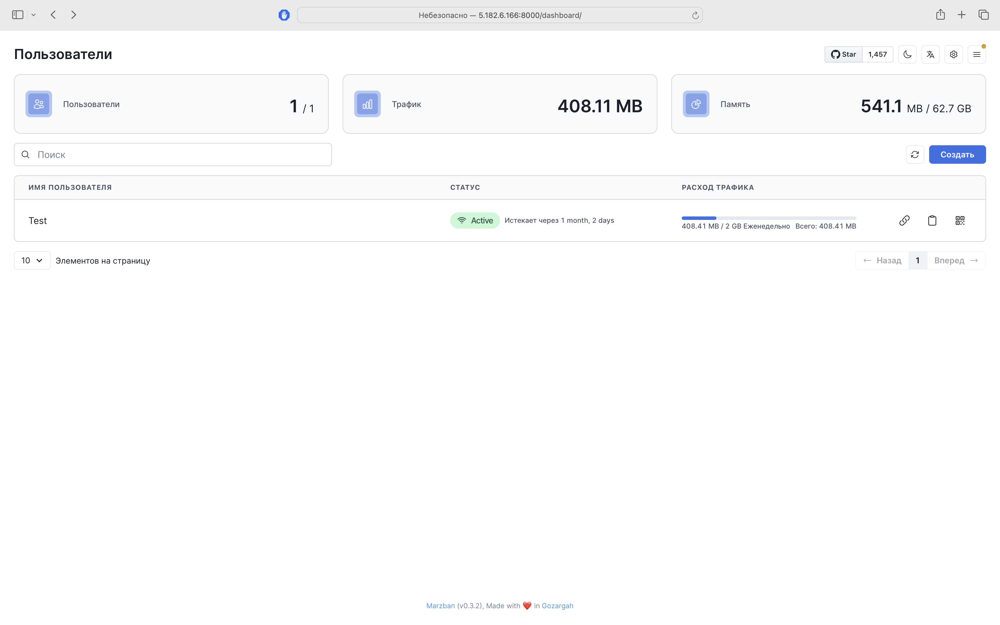
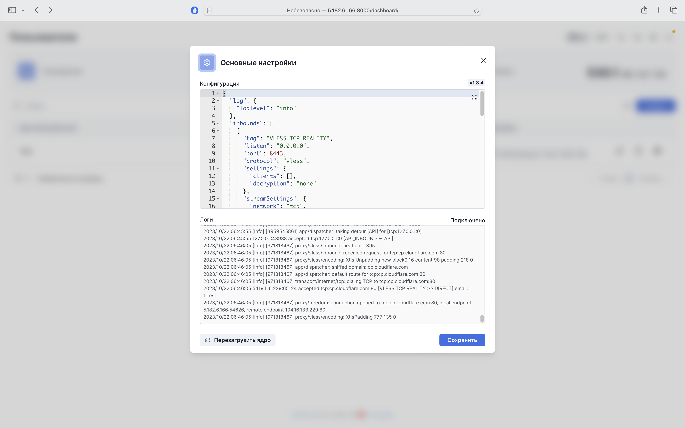
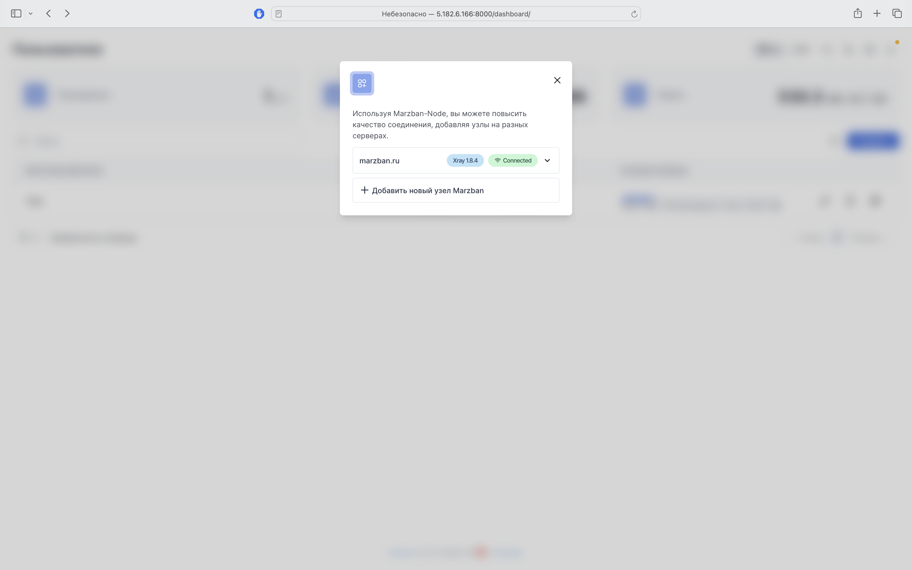

## Первое знакомство с панелью

По факту выполнения предыдущих шагов, Вам будет доступна панель управления, где Вы сможете увидеть всю статистику, сможете управлять панелью, подключениями пользователей и соьственно самими пользователями, а так же, при необходимости, подключить дополнительные узлы.

## Раздел "Основные настройки"

В данном разделе, Вы сможете отредактировать свой `xray_config.json` через удобный Web-UI.
Так же, в этом разделе, Вы сможете увидеть RealTime логи и перезагрузить ядро.

## Раздел "Настройки хоста"

В данном разделе, Вы сможете настроить ваши `inbound` через удобный Web-UI.

## Раздел "Настройки узла"

В данном разделе Вы сможете добавлять/удалять/изменять дополнительные узлы основной панели Marzban.

